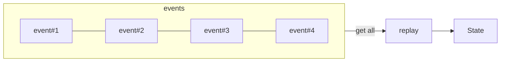
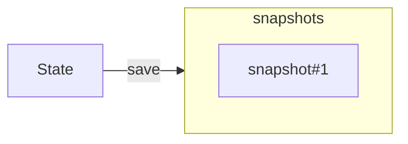
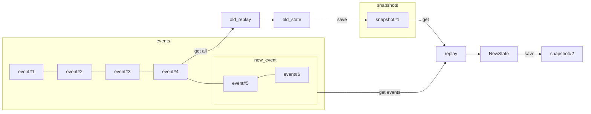

Concepts
=====================================================
### Event 를 재생시키면 State 를 얻을 수 있다

### State 를 저장하면 Snapshot 이 된다

### Snapshot 이후의 Event 를 가져와서 State 를 만들 수 있다. 

----------------------------------------------------
### 1. State
- 도메인의 상태를 의미한다.
    - 예시
        - 장바구니
        - 인벤토리
        - 유저 계좌 상태
        - git repository 코드 상태

- 항상 최신의 상태를 의미한다.
- 아래의 수식으로 나타낼 수 있다.
    - State = Replayed All Events, 상태는 모든 이벤트를 순차적으로 재생한 것이다.
    - State = Replayed Snapshot and Event List After Snapshot, 상태는 스냅샷과 스냅샷 이후의 이벤트를 재생한 것이다.
- 최신 Context(State) 를 Storage 에 저장하지 않는다. 최신 Context(State) 는 오로지 replay 시켜 알아낸다.
    - 사실상 State 는 Storage 머신의 역할을 Program 이 가져오는 구조

- State 를 식별할 수 있는 key 는 partitioning 에 적합해야 한다.
    - 이를 Partition Key(이후 pk라 칭함)라 부른다.
    - 예시
        - 장바구니 아이디
        - 인벤토리 아이디
        - 아이템 아이디
        - 계좌 번호

### 2. Event
- State 에 변화를 가하는 Aggregate(어그리거트) 를 말한다.
    - State 에 대한 CRUD 중 CUD 가 어그리거트가 됨
    - Event 를 순차적으로 재생시키면 현재 State 를 만들어낼 수 있다.
    - Event 에는 CUD를 어떻게 할 것인지 내용이 담긴다.
    - 예시
        - 장바구니에 아이템을 담는 이벤트 (어떤 아이템인지, 어디에 담기는지)
        - 유저 계좌에 500원을 입금하는 이벤트 (500원을 plus 시킨다.)
        - 유저 계좌에서 1000원을 출금하는 이벤트 (1000원을 minus 시킨다.)
        - 특정 line 에 코드가 변경되는 이벤트
        - branch 가 merge 되는 이벤트

- Event 는 그 자체로 식별이 가능하다. (Event ID가 고유해야한다는 의미)
- Event ID 는 그 자체로 Sotrable해야 한다.
- Event 는 PK 단위로 저장되므로, 어느 PK 에 속하는지 알 수 있어야 한다.
    - PK 로 Event List 를 조회하면, 쌓인 Event 순서대로 불러올 수 있어야 함

### 3. Snapshot
- Event List 를 Replay 시켜 얻어낸 State 혹은 과거에 저장한 State 를 의미한다.
- Snapshot 이후 의 event 가 없으면 Snapshot 이 State 가 된다.
- Snapshot 은 사실상 과거의 State 이므로, PK가 식별자다.
- Snapshot 이 구성된 마지막 Event 가 어떤것인지 알아내기 위해 EventID 를 가져야 한다.
- State 의 schema 가 변할 수 있는데, Snapshot 은 이 schema의 버전 관리를 해야한다.
  - 예
    - 계좌 event 가 총 100개가 있음
    - 계좌스키마를 계좌v1 라고 부르고, event를 replay 해서 계좌v1 의 State 를 만들어낼 수 있다.
    - 이를 저장하면 계좌v1의 snapshot이 저장된 것
    - 이후, 계좌v1과 다르게 계좌v2 스키마가 새로 정의됨
    - event 100개를 replay 하거나, 계좌v1 + event list 를 replay 해서 계좌v2 State 를 만들 수 있음
    - 계좌v2 State 를 저장하면 계좌v2 snapshot이 저장되는 것, 기존 계좌v1 snapshot은 그대로 있어야 한다.