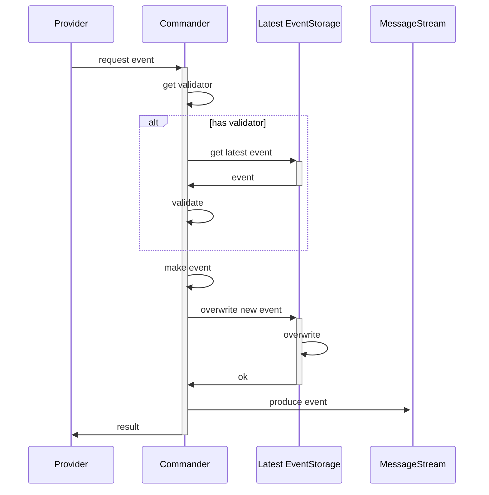
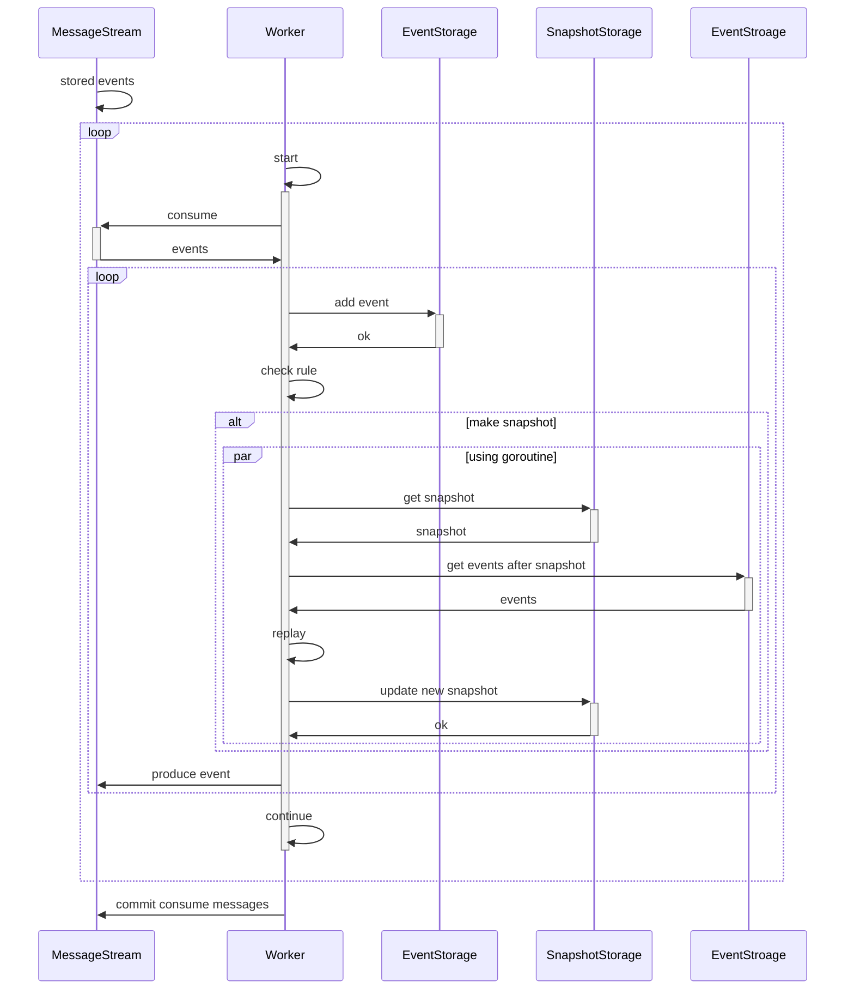
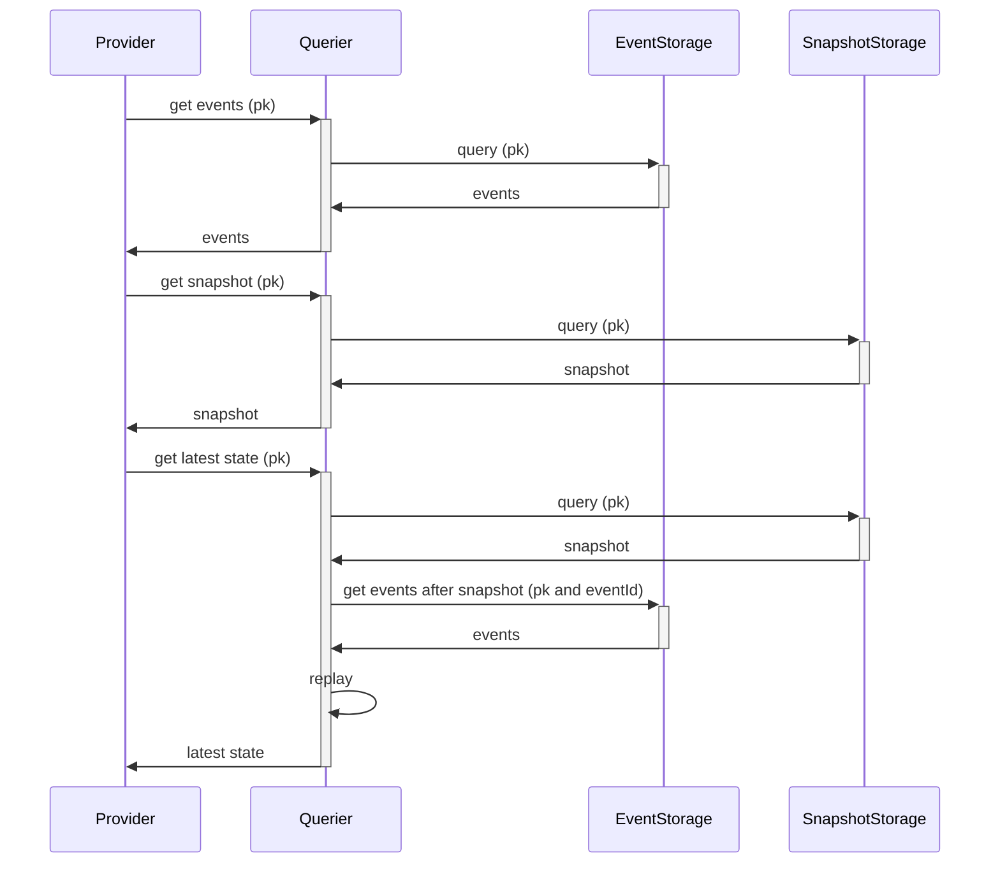

비동기적으로 Event Sourcing 을 하는 시퀀스 다이어그램
========================================
* * *
### Purpose
1. 빠른 응답이 중요한 도메인
2. State 및 Status 단순하고, 최신 이벤트만으로 Validating 이 가능한 도메인
3. Query view 구성이 되기까지 시간이 상대적으로 여유있는 도메인
### Domain 설명
- Provider
  - Event Sourcing 요청자
- Commander : Event 생산자
- Worker : 메세지 스트림을 소비하는 워커
- Querier : Storage 를 조회하는 도메인
- Storage
  - MessageStream : Event 메세지 스트림
  - Latest Event Storage : PK의 최신 Event 만 다루는 저장소
  - Event Storage : Event 저장소
  - Snapshot Storage : Replay 된 State Snapshot 저장소
* * *
### Core Rules
- Validating
  - 최신 이벤트만 사용하여 validating 한다
- Command 요청 시
  - Message Stream에 잘 써지면 return 한다
- Snapshot 저장
  - Snapshot Rule 에 따라, 주기적으로 저장
  - Query 요청 중, 최신 State 를 조회하면 snapshot 저장

* * *
### Request Event Sequence Diagram

* * *
### Event Consuming Sequence Diagram

* * *
### Event/Snapshot/State Querier Sequence Diagram
