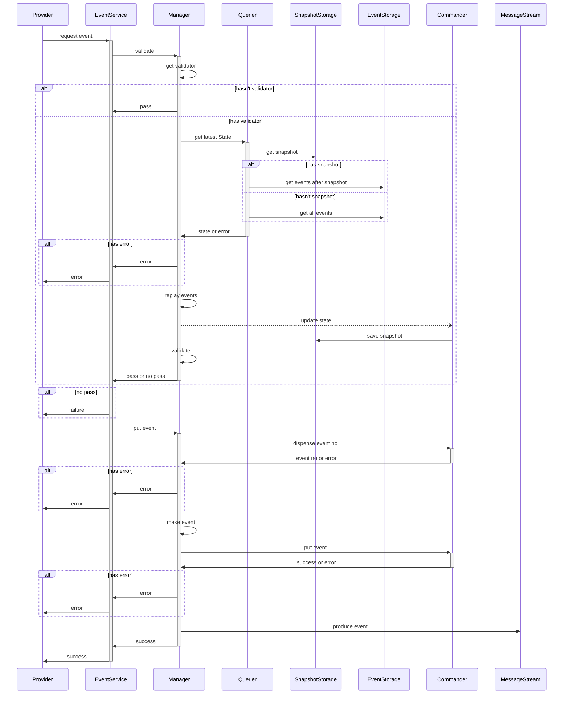

동기적으로 Event Sourcing 을 하는 시퀀스 다이어그램
============================================
* * *
### Purpose
1. 이벤트 소싱 적용 이점이 많으나, 최신 State 를 조회가 빈번한 도메인
2. State 및 Status 가 복잡하여, 상세한 Validating 이 필요한 도메인
3. 동기적 응답이 상대적으로 중요한 도메인
4. 네트워크 비용이 부담스러운 도메인
### Domain 설명
- Provider
  - Event Sourcing 요청자
- EventService : 하위 도메인을 노출하는 서비스
  - Domains
    - Manager : Validate, Queirer, Commander, Storage 를 관리하는 매니저
    - Querier : Event Sourcing 에서 Query 담당
    - Commander : Event Sourcing 에서 Command 담당
  - Storage
    - SnapshotStorage : Replay 된 State snapshot 저장소
    - EventStorage : Event 저장소
    - MessageStream : Event 메세지 스트림
* * *
### Core Rule 설명
- Validating
  - 최신 State 를 기준으로 validation 을 진행
- Snapshot 저장
  - validating 을 위해 최신 state 를 만들어냈을 때
  - query 를 통해 최신 state 를 가져왔을 때
- Put Event 시
  - event no 를 먼저 발급받고, event 를 저장
  - 동기적 ES 는 최신 State 를 부를일이 많기 때문에, event no 로 쿼리해야할 일이 많음
- Produce Event
  - 다 처리가 된 후 MessageStream 에 event 를 저장
* * *
### Request Event Sequence Diagram
