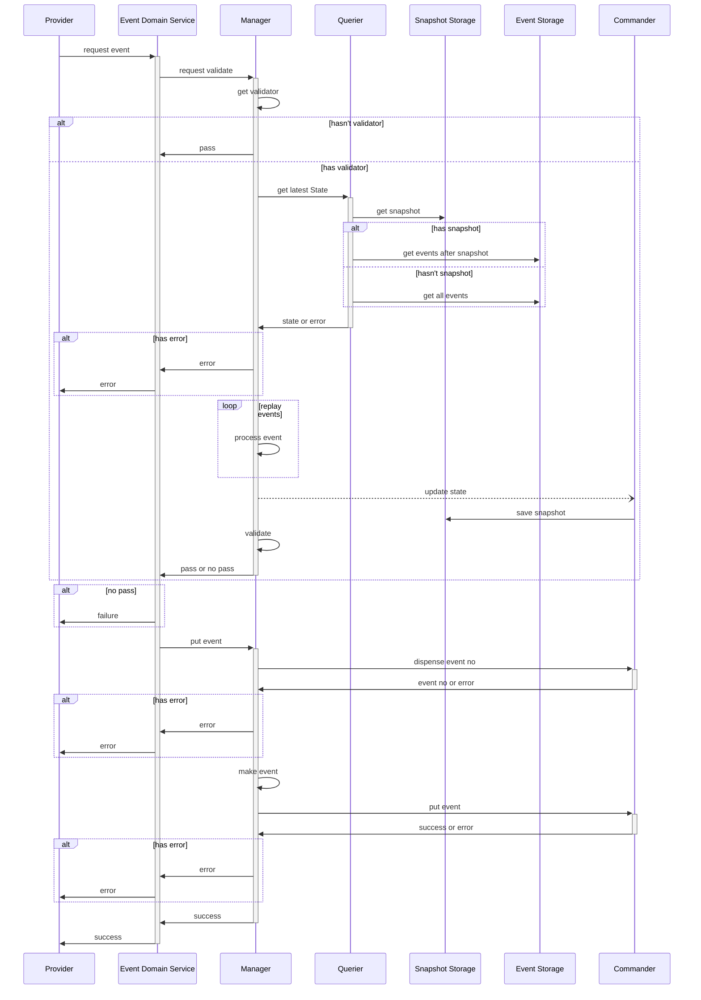

Message Stream 을 사용하지 않는 시퀀스 다이어그램
----------------------------------------
- Domains
  - Provider : Event Sourcing 에 요청하는 요청자
  - Event Domain Service : Event Sourcing으로 구현된 도메인을 접근할 수 있게 노출한 서비스
  - Manager : Event Sourcing 을 관리하는 매니저
  - Querier : Event Sourcing 에서 조회를 담당
  - Commander : Event Sourcing 에서 처리를 담당
  - Snapshot Storage : State 의 Snapshot 을 저장
  - Event Storage : Event 를 저장
- Core Rules
   - 스냅샷을 저장할 때
     - validating 을 위해 최신 state 를 가져왔을 때
     - query 를 통해 최신 state 를 가져왔을 때
